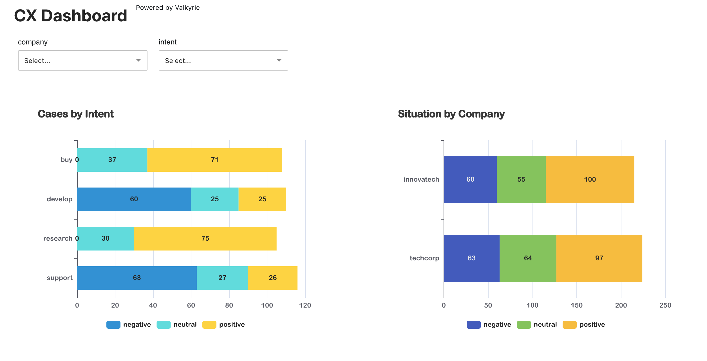

## About Valkyrie

Valkyrie is a prototype for a product designed to enable users to create dashboards quickly and declaratively.
This project aims to simplify the process of dashboard creation by providing an intuitive and efficient way to define and customize dashboards without extensive coding knowledge.

 Key Features:
  - Declarative syntax for defining dashboard components
  - Rapid prototyping capabilities
  - User-friendly interface for customization
  - Support for various data sources and visualization types
  
 Valkyrie is ideal for users who need to create and manage dashboards efficiently, whether for business analytics, monitoring, or reporting purposes.

Valkyrie is based on the following technologies:

- Kafka
- TimescaleDB
- Redis


## Prereqs

- PostgreSQL installed (pg_configure)
- Docker (and compose)
- Python 3.13.x
- NodeJs v22.14.0


## Installation

```
make install
```

## Starting Infra

```
touch .env
make infra-start
```

## Starting the Components


We'll start the Valkyrie API:

```
# Starting the Server
make server-run
```

## Create your first metric

In the next step, we'll use the API server to create the first sample metric:

```
curl --location 'localhost:8000/measurements' \
--header 'Content-Type: application/json' \
--data '{
    "name": "cx_metrics",
    "dimensions": [
        { "name": "state", "type": "varchar" },
        { "name": "city", "type": "varchar" },
        { "name": "base", "type": "varchar" },
        { "name": "company", "type": "varchar" },
        { "name": "intent", "type": "varchar" }
    ],
    "fields": [
        { "name": "customer_id", "type": "varchar" },
        { "name": "negative", "type": "integer" },
        { "name": "neutral", "type": "integer" },
        { "name": "positive", "type": "integer" }
    ]
}'
```

## Bulk Data Ingestion

In the next, we'll ingest some sample data. After ingestion, the data-topic will be created for consuming messages. We are running several curl commands due to the shell prompt limit:

```
curl --location 'localhost:8000/bulk' \
--header 'Content-Type: text/plain' \
--data 'cx_metrics,state=CA,city=San\ Francisco,base=HQ,company=techcorp,intent=buy customer_id=12345,negative=0,neutral=1,positive=0 1596484800
cx_metrics,state=NY,city=New\ York,base=NYC,company=techcorp,intent=support customer_id=12346,negative=1,neutral=0,positive=0 1596484800
cx_metrics,state=TX,city=Austin,base=ATX,company=techcorp,intent=buy,customer_id=12347 negative=0,neutral=0,positive=1 1596484800
cx_metrics,state=CA,city=Los\ Angeles,base=LA,company=techcorp,intent=support customer_id=12348,negative=2,neutral=1,positive=0
cx_metrics,state=WA,city=Seattle,base=SEA,company=techcorp,intent=buy customer_id=12349,negative=0,neutral=2,positive=1
cx_metrics,state=IL,city=Chicago,base=CHI,company=techcorp,intent=support customer_id=12350,negative=1,neutral=1,positive=1 '

curl --location 'localhost:8000/bulk' \
--header 'Content-Type: text/plain' \
--data 'cx_metrics,state=FL,city=Miami,base=MIA,company=techcorp,intent=buy customer_id=12351,negative=0,neutral=0,positive=3
cx_metrics,state=NV,city=Las\ Vegas,base=LV,company=techcorp,intent=support customer_id=12352,negative=2,neutral=0,positive=1
cx_metrics,state=CO,city=Denver,base=DEN,company=techcorp,intent=buy customer_id=12353,negative=0,neutral=1,positive=2
cx_metrics,state=MA,city=Boston,base=BOS,company=techcorp,intent=support customer_id=12354,negative=1,neutral=0,positive=1
cx_metrics,state=TX,city=Houston,base=HOU,company=techcorp,intent=buy customer_id=12355,negative=0,neutral=1,positive=2
cx_metrics,state=GA,city=Atlanta,base=ATL,company=techcorp,intent=support customer_id=12356,negative=1,neutral=1,positive=0 '

curl --location 'localhost:8000/bulk' \
--header 'Content-Type: text/plain' \
--data 'cx_metrics,state=NC,city=Charlotte,base=CLT,company=techcorp,intent=buy customer_id=12357,negative=0,neutral=2,positive=1
cx_metrics,state=AZ,city=Phoenix,base=PHX,company=techcorp,intent=support customer_id=12358,negative=2,neutral=1,positive=0
cx_metrics,state=OH,city=Columbus,base=CMH,company=techcorp,intent=buy,customer_id=12359 negative=0,neutral=0,positive=3
cx_metrics,state=MI,city=Detroit,base=DTW,company=techcorp,intent=support customer_id=12360,negative=1,neutral=1,positive=1
cx_metrics,state=PA,city=Philadelphia,base=PHL,company=techcorp,intent=buy customer_id=12361,negative=0,neutral=1,positive=2
cx_metrics,state=WA,city=Spokane,base=GEG,company=techcorp,intent=support customer_id=12362,negative=2,neutral=0,positive=1 '

curl --location 'localhost:8000/bulk' \
--header 'Content-Type: text/plain' \
--data 'cx_metrics,state=OR,city=Portland,base=PDX,company=innovatech,intent=research customer_id=12363,negative=0,neutral=1,positive=2 1596484800
cx_metrics,state=NV,city=Reno,base=RNO,company=innovatech,intent=develop customer_id=12364,negative=1,neutral=0,positive=1 1596484800
cx_metrics,state=UT,city=Salt\ Lake\ City,base=SLC,company=innovatech,intent=research customer_id=12365,negative=0,neutral=2,positive=1 1596484800
cx_metrics,state=CO,city=Boulder,base=BDR,company=innovatech,intent=develop customer_id=12366,negative=2,neutral=1,positive=0
cx_metrics,state=NM,city=Albuquerque,base=ABQ,company=innovatech,intent=research customer_id=12367,negative=0,neutral=1,positive=2
cx_metrics,state=AZ,city=Tucson,base=TUS,company=innovatech,intent=develop customer_id=12368,negative=1,neutral=1,positive=1 '

curl --location 'localhost:8000/bulk' \
--header 'Content-Type: text/plain' \
--data 'cx_metrics,state=CA,city=San\ Diego,base=SAN,company=innovatech,intent=research customer_id=12369,negative=0,neutral=0,positive=3
cx_metrics,state=NV,city=Las\ Vegas,base=LAS,company=innovatech,intent=develop customer_id=12370,negative=2,neutral=0,positive=1
cx_metrics,state=CO,city=Denver,base=DEN,company=innovatech,intent=research customer_id=12371,negative=0,neutral=1,positive=2
cx_metrics,state=UT,city=Provo,base=PVU,company=innovatech,intent=develop customer_id=12372,negative=1,neutral=0,positive=1
cx_metrics,state=NM,city=Santa\ Fe,base=SAF,company=innovatech,intent=research customer_id=12373,negative=0,neutral=1,positive=2
cx_metrics,state=AZ,city=Phoenix,base=PHX,company=innovatech,intent=develop customer_id=12374,negative=1,neutral=1,positive=0 '

curl --location 'localhost:8000/bulk' \
--header 'Content-Type: text/plain' \
--data 'cx_metrics,state=TX,city=Dallas,base=DFW,company=innovatech,intent=research customer_id=12375,negative=0,neutral=2,positive=1
cx_metrics,state=OK,city=Oklahoma\ City,base=OKC,company=innovatech,intent=develop customer_id=12376,negative=2,neutral=1,positive=0
cx_metrics,state=KS,city=Wichita,base=ICT,company=innovatech,intent=research customer_id=12377,negative=0,neutral=0,positive=3
cx_metrics,state=MO,city=Kansas\ City,base=MCI,company=innovatech,intent=develop customer_id=12378,negative=1,neutral=1,positive=1
cx_metrics,state=AR,city=Little\ Rock,base=LIT,company=innovatech,intent=research customer_id=12379,negative=0,neutral=1,positive=2
cx_metrics,state=LA,city=New\ Orleans,base=MSY,company=innovatech,intent=develop customer_id=12380,negative=2,neutral=0,positive=1 '
```

## Start the bulk data loader

The Bulk data loader will process messages loaded via Bulk API or `valkyrie` kafka topic.
To start the Data Loader, use the following command:

```
make loader-run
```

## Create Datasources

In the next step we'll create some datasources to build our dashboard:

```
curl --location 'localhost:8000/datasources' \
--header 'Content-Type: application/json' \
--data '{
    "name": "cx_datasource",
    "query": {
        "measurement": "cx_metrics",
        "fields": [ 
            { "expression": "intent", "alias": "intent" },
            { "expression": "sum(negative)", "alias": "negative" },
            { "expression": "sum(neutral)", "alias": "neutral" },
            { "expression": "sum(positive)", "alias": "positive" }
        ],
        "filters": [
            { "field": "company", "op": "eq", "value": "$company" },
            { "field": "intent", "op": "eq", "value": "$intent" }
        ],
        "group": ["intent"],
        "order": [ 
            {"field": "intent", "order": "asc"}
        ],
        "window": "30 days"
    }
}'

curl --location 'http://localhost:8000/datasources' \
--header 'Content-Type: application/json' \
--data '{
    "name": "intent_datasource",
    "query": {
        "measurement": "cx_metrics",
        "fields": [
            {
                "expression": "base",
                "alias": "base"
            },
            {
                "expression": "sum(case when intent = '\''support'\'' then 1 else 0 end)",
                "alias": "support"
            },
            {
                "expression": "sum(case when intent = '\''buy'\'' then 1 else 0 end)",
                "alias": "buy"
            }
        ],
        "filters": [
            {
                "field": "company",
                "op": "eq",
                "value": "$company"
            },
            {
                "field": "intent",
                "op": "eq",
                "value": "$intent"
            }
        ],
        "group": [
            "base"
        ],
        "order": [
            {
                "field": "base",
                "order": "asc"
            }
        ],
        "window": "30 days"
    }
}'

curl --location 'localhost:8000/datasources' \
--header 'Content-Type: application/json' \
--data '{
    "name": "company_datasource",
    "query": {
        "measurement": "cx_metrics",
        "fields": [ 
            { "expression": "company", "alias": "etapa" },
            { "expression": "sum(negative)", "alias": "negative" },
            { "expression": "sum(neutral)", "alias": "neutral" },
            { "expression": "sum(positive)", "alias": "positive" }
        ],
        "filters": [
            { "field": "company", "op": "eq", "value": "$company" }
        ],
        "group": ["company"],
        "order": [ 
            {"field": "company", "order": "asc"}
        ],
        "window": "30 days"
    }
}'
```

## Create Filters

Our dashboard will need filters, so we'll create them.

```
curl --location 'http://localhost:8000/filters' \
--header 'Content-Type: application/json' \
--data '{
    "name": "cx_filter_company",
    "datasource": "cx_datasource",
    "dimension": "company",
    "order": "asc"
}'

curl --location 'http://localhost:8000/filters' \
--header 'Content-Type: application/json' \
--data '{
    "name": "cx_filter_intent",
    "datasource": "cx_datasource",
    "dimension": "intent",
    "order": "asc"
}'
```

## Create Charts

Now we'll define our charts.

```
curl --location 'localhost:8000/charts' \
--header 'Content-Type: application/json' \
--data '{
    "name": "cx_chart",
    "datasource": "cx_datasource",
    "categories": 0,    
    "config": {
        "type": "stackedbar-horizontal",
        "width": 500,
        "height": 400,
        "theme": "light",
        "title": "Cases by Intent"
    }
}'
```

```
curl --location 'localhost:8000/charts' \
--header 'Content-Type: application/json' \
--data '{
    "name": "intent_chart",
    "datasource": "intent_datasource",
    "categories": 0,
    "config": {
         "type": "stackedbar-horizontal",
        "title": "Cases by Intent",
        "subtitle": "Vision per base",
        "width": 500,
        "height": 400,
        "theme": "light"
    }
}'
```

```
curl --location 'localhost:8000/charts' \
--header 'Content-Type: application/json' \
--data '{
    "name": "company_chart",
    "datasource": "company_datasource",
    "categories": 0,
    "config": {
        "width": 500,
        "height": 400,
        "title": "Situation by Company"
    }
}'
```

## Create the Dashboard

Next, we need to configurate the dashboard:

```
curl --location 'http://localhost:8000/dashboards' \
--header 'Content-Type: application/json' \
--data '{
    "name": "cx_dashboard",
    "config": {
        "title": "CX Dashboard",
        "filters": [ "cx_filter_company", "cx_filter_intent" ],
        "charts": [ 
            "cx_chart", 
            "company_chart",
            "intent_chart" 
        ]
    }
}'
```

## Testing the application

```
make dashboard-run
```

Access the dashboard URL:
http://localhost:3000/cx_dashboard

Voila!




# Known Problems

- Just a PoC for a product. It doesn't have a reliable code, tests etc. If you like it, use on your own risk. Contributions to the project are welcome.

- first time installation: the kafka topic `valkyrie` will be only created after running the server and ingesting some data. If you try to run the loader before it, will raise an error telling the topic does not exist.
